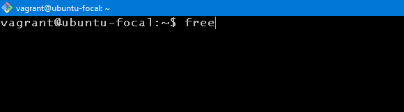

# 10 Linux Commands i learnt from my private study.  

## **Date:** The ``date`` command is used to check the date and time on the terminal.  
### Simply type in:  
  

### And it presents the following output:  
    

## **Cal:** The ``cal`` command is used to check the conventional calendar on the terminal.  
### Type in:  
  

### And it presents the following output:  
  

## **Free:** The ``free`` command is used to check available memory on the system in the terminal.  

### Type in:  
 

### And it presents the following output:  
   

 ## **Id:** The `id` command is used to display user and group ids of the current user.  
 ### Type in:  

### And it presents the following output:  

 ## **whoami:** The ``whoami`` command is used to check who i am logged in as.  
 ### Type in:  

### And it presents the following output:  
  

 ## **W:** The `W` command is used to check who i am logged in as, how long i have been online and what i am presently doing.  
 ### Type in:  

### And it presents the following output:  
  

 ## **hostname:** The `hostname` command is used to check the system hostname i am presently running.  
 ### Type in:  

### And it presents the following output:  
  

 ## **Df:** The `df` command is used to check the free hard disk space on my system.  
 ### Type in:  

### And it presents the following output:  
  

 ## **history:** The `history` command is used to check all prior commands that have been inputed on the terminal.  
 ### Type in:  
 

### And it presents the following output:  
 

 ## **Exit:** The `Exit` command is used to log out of the terminal. 
 ### Type in:  

### And it presents the following output:  

